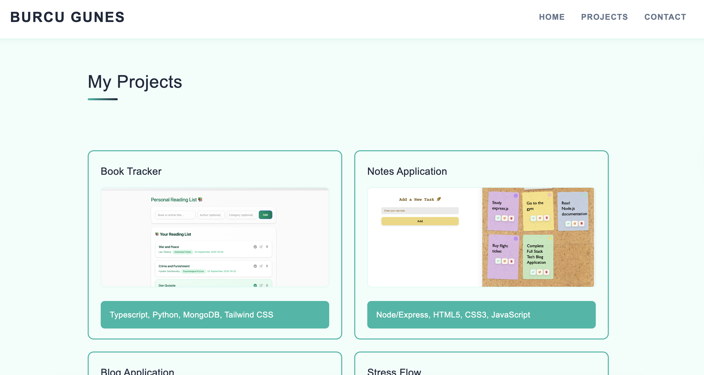
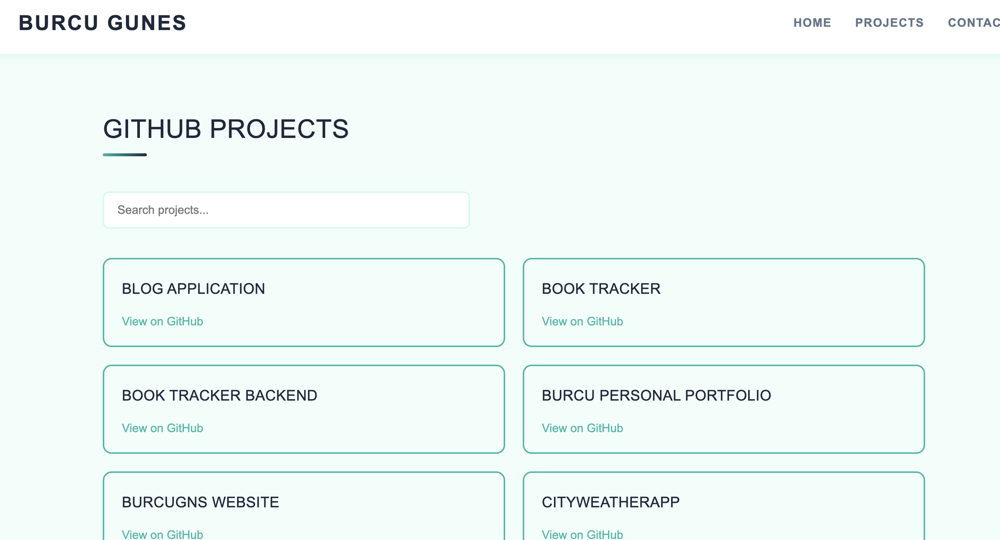
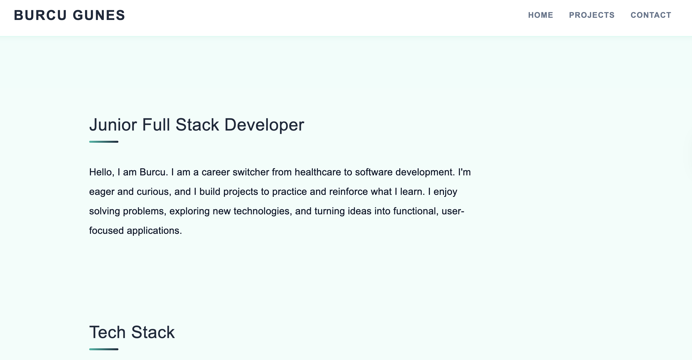

# React Portfolio

It is my personel portfolio created with React. It includes my short bio, my GitHub projects, skills, and contact information.

## Features

- **Responsive Design**: Fully responsive layout that works on desktop, tablet, and mobile devices
- **Multi-page Navigation**: Clean routing with React Router for Home, Projects, and Contact pages
- **GitHub Integration**: Dynamic project fetching from GitHub API with search functionality
- **Contact Information**: Easy to access email, LinkedIn, and GitHub links

## Technologies Used

- **React**
- **Vite**
- **CSS3**
- **GitHub API**

## Installation

1. Clone the repository:

```bash
git clone https://github.com/burcugns/react-portfolio.git
cd react-portfolio
```

2. Install dependencies:

```bash
npm install
```

3. Start the development server:

```bash
npm run dev
```

4. Open your browser and navigate to the local host.

## Screenshoot





## Project Structure

```
react-portfolio/
├── public/
├── src/
│   ├── assets/
│   │   └── react.svg
│   ├── components/
│   │   ├── AboutMe.jsx
│   │   ├── Contact.jsx
│   │   ├── Footer.jsx
│   │   ├── Header.jsx
│   │   └── ProjectCard.jsx
│   ├── img/
│   │   └── (images)
│   ├── pages/
│   │   ├── ContactPage.jsx
│   │   ├── HomePage.jsx
│   │   └── ProjectsPage.jsx
│   ├── App.css
│   ├── App.jsx
│   ├── index.css
│   └── main.jsx
├── index.html
├── package.json
├── vite.config.js
└── README.md
```

## Deployment

This is my project live on Render.com <br>
https://react-portfolio-1-gbvg.onrender.com/
